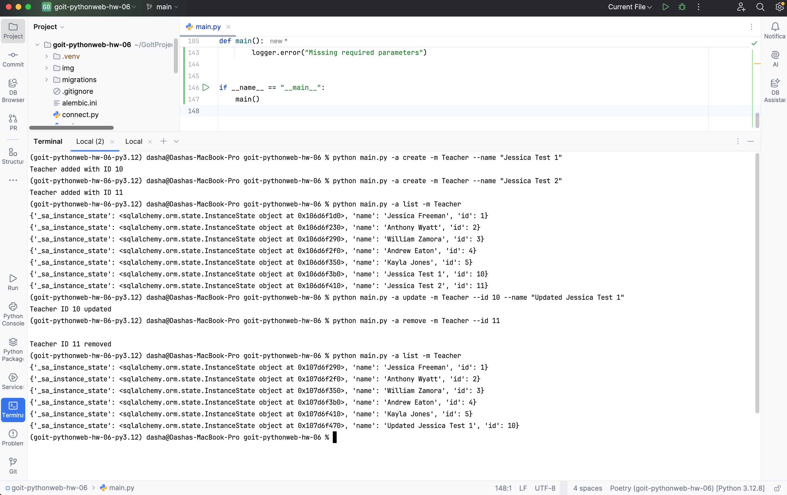
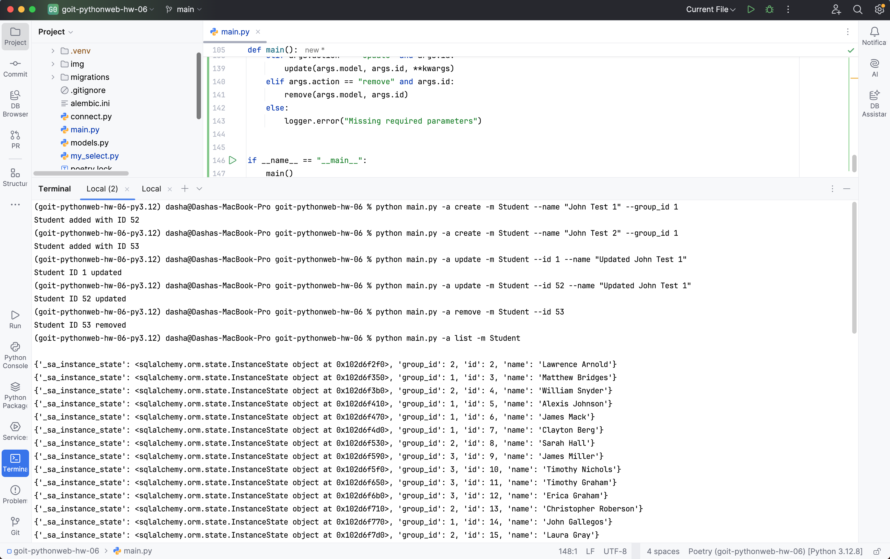
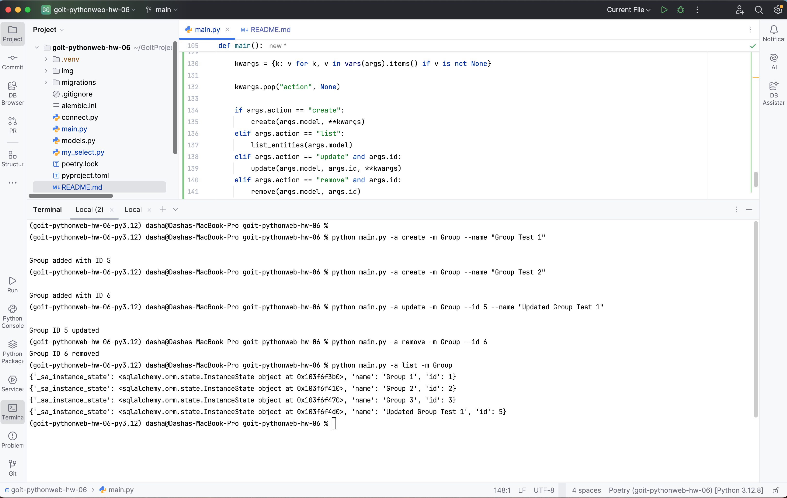
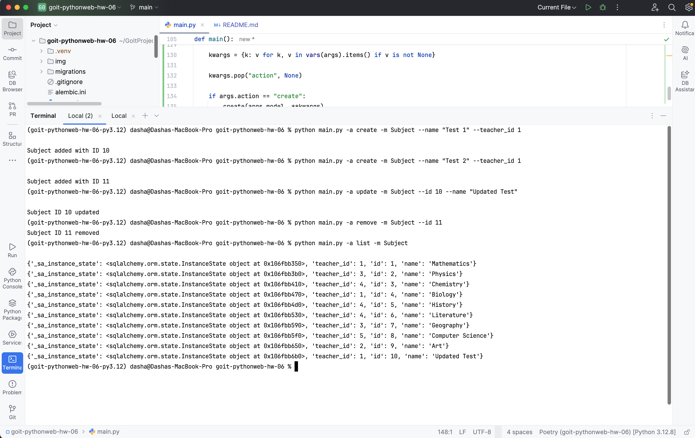
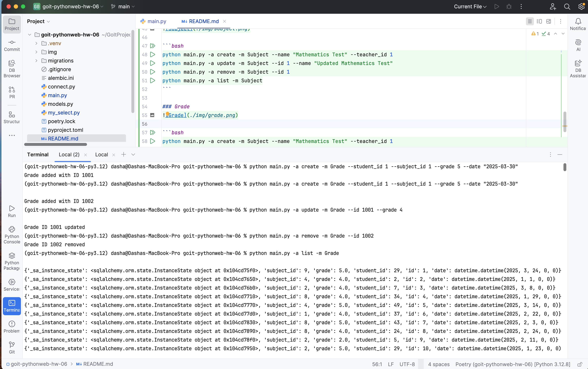

# goit-pythonweb-hw-06

## Запуск

```bash
docker run --name db-hw-6 -p 5432:5432 -e POSTGRES_PASSWORD=1239 -d postgres
```

## Демо Diagram


## Демо CLI

### Teacher


```bash
python main.py -a create -m Teacher --name "Jessica Test"
python main.py -a update -m Teacher --id 1 --name "Updated Jessica Test"
python main.py -a remove -m Teacher --id 1
python main.py -a list -m Teacher
```

### Student


```bash
python main.py -a create -m Student --name "John Test" --group_id 1
python main.py -a update -m Student --id 1 --name "Updated John Test"
python main.py -a remove -m Student --id 1
python main.py -a list -m Student
```

### Group


```bash
python main.py -a create -m Group --name "Group Test"
python main.py -a update -m Group --id 1 --name "Updated Group Test"
python main.py -a remove -m Group --id 1
python main.py -a list -m Group
```

### Subject


```bash
python main.py -a create -m Subject --name "Mathematics Test" --teacher_id 1
python main.py -a update -m Subject --id 1 --name "Updated Mathematics Test"
python main.py -a remove -m Subject --id 1
python main.py -a list -m Subject
```

### Grade


```bash
python main.py -a create -m Grade --student_id 1 --subject_id 1 --grade 5 --date "2025-03-30"
python main.py -a update -m Grade --id 1 --grade 4
python main.py -a remove -m Grade --id 1
python main.py -a list -m Grade
```